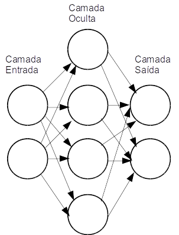

# Redes neurais e Deep Learning utilizando Java
[**Cleuton Sampaio**](https://github.com/cleuton) - [**LinkedIn**](https://www.linkedin.com/in/cleutonsampaio/) 

Todo o conteúdo, quando não explicitamente indicado, está liberado sob a [licença Creative Commons Atribuição 4.0 Internacional](http://creativecommons.org/licenses/by/4.0/). O código-fonte está liberado sob a [licença Apache 2.0](https://www.apache.org/licenses/LICENSE-2.0).

# Introdução

## Papo furado

Sério, o que sua empresa roda no ambiente de produção? De acordo com a popularidade e as estatísticas, é mais provável que sejam sistemas feitos em **Java**, certo? Claro que sim. Java é o novo **COBOL**. Embora muitos sistemas corporativos e comerciais estejam sendo desenvolvidos em outras linguagens, como **python**, os dados demonstram que Java ainda é a plataforma campeã no mundo corporativo.

E existem razões para isso, por exemplo, o grande número de desenvolvedores Java no mundo. Mas não é só isso... Java é uma plataforma completa, madura e baseada em padrões, com um vasto ecossistema de componentes e frameworks igualmente maduros. Além disso, temos a [performance *acachapante*](https://benchmarksgame-team.pages.debian.net/benchmarksgame/faster/python.html) de Java sobre outras linguagens, como o python. Eu até [**já escrevi um artigo sobre este assunto, no meu outro blog: O Bom programador**](http://www.obomprogramador.com/2019/03/python-paralelismo-e-gil-nem-tudo.html).

Porém, linguagens de script, como python e **R** são muito utilizadas em estudos de ciência de dados, machine learning e **deep learning**, talvez pela facilidade de codificação, ou pelo excelente conjunto de bibliotecas para isto. Realmente, criar um modelo baseado em Redes Neurais em Python ou R, seja utilizando o **Keras** ou outra API, é muito simples. Você só precisa saber COMO criar redes neurais, a implementação é muito enxuta, com baixa [**complexidade acidental**](http://www.obomprogramador.com/2012/12/complexidade-acidental.html). Isso é totalmente o contrário de Java!

Mas dizer que Java não serve para deep learning ou ciência de dados, é simplesmente **papo furado**. 

Eu diria que a melhor linguagem para se trabalhar com qualquer problema de **Inteligência Artificial** (incluíndo ciência de dados) seria **C++**. Por quê? Bom, as bibliotecas foram escritas em C++, e o desempenho é imbatível! Mas C++ é muito difícil de programar e até de compilar! Requer muito tempo e esforço para construir modelos simples. Logo, Java pode ser uma alternativa mais fácil e popular.

Resolvi começar esta série de artigos porque fui convidado a lecionar um curso sobre implementação de soluções de **IA** utilizando Java, e quero compartilhar com vocês a minha experiência. 

*Bom proveito!*

## Inteligência artificial

Desde os anos 50, quando um cientista chamado [*John McCarthy* usou este termo pela primeira vez](https://pt.wikipedia.org/wiki/Intelig%C3%AAncia_artificial), a **IA** tem sido alvo de muitos estudos e tendências, especialmente agora, nos últimos 10 anos. 

O estudo de IA tem muitas vertentes, como por exemplo a construção de [**Agentes inteligentes**](https://pt.wikipedia.org/wiki/Agente_inteligente). Uma corrente de estudos focou em criação de [**Sistemas especialistas**](http://www.scielo.br/scielo.php?script=sci_arttext&pid=S0100-19651997000100006), utilizando *motores de inferência*, baseados em regras que utilizam técnicas como **encadeamento para a frente** de modo a concluir sobre dados novos. Eles são capazes de armazenar novas regras e interligá-las de modo a tomar decisões. 

Porém, a especificação de regras requer conhecimento do domínio do problema, portanto, não é tarefa simples. Outra corrente de IA se baseou nos próprios dados, imitando a forma como o nosso cérebro *aprende*, e esta é a corrente que conhecemos como **Redes Neurais**, e seu uso em aprendizagem de máquina é conhecido como *aprendizagem profunda* ou **Deep Learning**.

## Redes neurais

Deep learning (ou aprendizagem profunda) é um ramo da Data Science, mais especificamente de Machine learning, que utiliza grafos de funções em camadas para resolver problemas de classificação e regressão, supervisionados ou não. Estes grafos em camadas são também conhecidos pela metáfora: “Rede neural”,
pois se parecem com a arquitetura do cérebro humano.

Os nós são o que chamamos de **neurônios** e as arestas são os dados e os pesos (veremos mais adiante). Cada neurônio recebe as entradas, multiplica pelos pesos e passa tudo por uma **função de ativação**, que determinará o sinal de saída.

