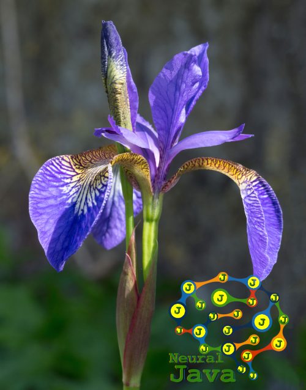
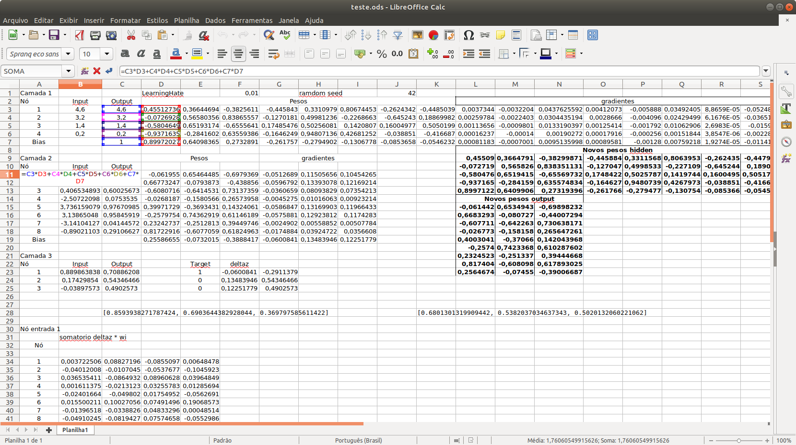
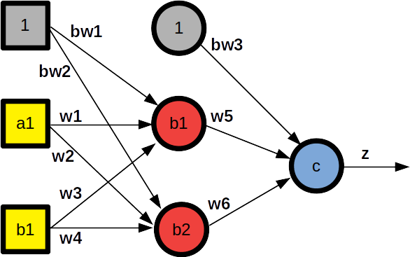

# Redes neurais e Deep Learning utilizando Java
## Classificação do dataset IRIS com MLP multiclasse
[**Cleuton Sampaio**](https://github.com/cleuton) - [**LinkedIn**](https://www.linkedin.com/in/cleutonsampaio/) 


Todo o conteúdo, quando não explicitamente indicado, está liberado sob a [licença Creative Commons Atribuição 4.0 Internacional](http://creativecommons.org/licenses/by/4.0/). O código-fonte está liberado sob a [licença Apache 2.0](https://www.apache.org/licenses/LICENSE-2.0).



Podemos ter vários neurônios (ou nõs) de saída, caso o problema de classificação que queiramos resolver seja multiclasse. Um exemplo disso é o famoso dataset [**IRIS**](http://www.lac.inpe.br/~rafael.santos/Docs/R/CAP394/WholeStory-Iris.html), uma pesquisa classificatória que dividiu as espécies de flores IRIS em 3 categorias, de acordo com 4 características. 

Para classificar as flores, precisamos da **não linearidade** proporcionada por um **MLP**. 

## Antes de mais nada

O código que vou mostrar é uma melhoria do código original do [**MLP**](../multilayerperceptron/src/main/java/com/neuraljava/samples/mlp/MLP.java) que apresentei a vocês. Seu objetivo é explicar melhor os fundamentos e técnicas de redes neurais, organizando o código-fonte de uma maneira mais *Javística*. **DE FORMA ALGUMA ESTE CÓDIGO VISA DESEMPENHO OU PRECISÃO**.

Eu reorganizei o código, refatorando-o em várias classes, cada uma com sua responsabilidade. Para ser franco, tentei várias abordagens e parei por falta de paciência. Pode ser que haja maneiras melhores de refatorar esse código.

A principal diferença para o [**MLP**](../multilayerperceptron/src/main/java/com/neuraljava/samples/mlp/MLP.java) é a possibilidade de criar uma rede com vários nós (*neurônios*) de saída, o que permite uma classificação multiclasse. 

Olhe [**o código-fonte**](../iris) que é bem simples de entender. 

## O processo de uma rede Neural

Eu criei uma planilha [**teste.ods**](./teste.ods) para poder entender e testar o modelo. É muito complicado, mas dando duplo-clique nas células, você pode ver a origem e os cálculos efetuados.



Precisamos que nosso modelo "aprenda" os pesos a serem utilizados para estimar a classe de uma flor, baseado em suas 4 características. Este aprendizado é comandado por este trecho de código do arquivo [**IRISClassifier**](./src/main/java/com/neuraljava/samples/mlpgen/api/IrisClassifier.java): 

```
		int irisElementos = 150;
		int categorias = 3;
		int variaveis = 4;
		int epochs = 1000;
		double learningRate = 0.01;
		
		double [][] iris = loadIris(irisElementos, categorias, variaveis);		
		
		model.fit(iris, 120, epochs,learningRate);
```

O método **fit()** treina o modelo utilizando os dados de teste (120 registros de um total de 150). Mas, *qual modelo*? O modelo é montado um pouco antes de invocarmos o **fit()** e eu me inspirei no modelo do [**Keras**](https://keras.io/) para criar essa API: 

```
		model.layers.add(new Layer(4,null,model)); // Input layer não tem activation
		model.layers.add(new Layer(8,new Sigmoid(),model));
		model.layers.add(new Layer(3,new Sigmoid(),model));
```

Uma camada de **input** com 4 nós (são quatro variáveis de entrada), uma camada **hidden** com 8 nós, utilizando [**Sigmoid**](https://pt.wikipedia.org/wiki/Fun%C3%A7%C3%A3o_sigm%C3%B3ide) como função de ativação, e uma camada de **saída** com 3 nós (são 3 classes), também utilizando **Sigmoid**.

Estou utilizando [**MSE**- Erros médios quadráticos como função de custo, e **Gradient Descent**, como método de aprendizagem](http://mccormickml.com/2014/03/04/gradient-descent-derivation/).

### Forward propagation

O treinamento consiste em repetir diversas vezes ([**epochs**](https://towardsdatascience.com/epoch-vs-iterations-vs-batch-size-4dfb9c7ce9c9)) o cálculo da rede, pegando cada registro e obtendo uma saída. 

Para cada registro, observamos as diferenças entre o valor estimado pelo modelo e o valor real, e vamos acumulando para calcular o **MSE**.



Por exemplo, a entrada para o nó **b1** (netb1) é a combinação dos valores dos nós de entrada multiplicados pelos seus pesos, somado ao peso do **bias**: 

```
netb1 = somatório(ai * wi) + bw1
```

### Backpropagation

Precisamos calcular o erro e ajustar os pesos dos nós (e dos Bias) para fazer nosso modelo "aprender". Como fazemos isso? Corrigimos cada peso de acordo com sua "responsabilidade" no erro final. Pesos mais responsáveis recebem maior correção. 

Na verdade, queremos **otimizar** a função de custo, encontrando o seu valor mínimo (de preferência global): 


Nossa função de custo é o **MSE**, então, queremos chegar aos valores dos pesos que propiciem um menor MSE possível. 

O método de cálculo da *backpropagation* é encontrar o **gradiente** (a taxa de variação de cada peso em função da saída), e modificar os pesos de acordo com a **taxa de aprendizado** (**learning rate**) e o próprio **gradiente**. Pouco a pouco vamos modificando os pesos até o treinamento terminar. Pode ser que tenhamos encontraro o **mínimo global* ou não. Mas paramos quando considerarmos o erro (o valor do MSE) razoável.

**Derivadas parciais** - Precisamos calcular as [*derivadas parciais*](https://towardsdatascience.com/step-by-step-the-math-behind-neural-networks-ac15e178bbd) do erro com relação a cada peso da rede. 

O código Java faz isso na classe [**Model**, dentro do método **backPropagation()**](./src/main/java/com/neuraljava/samples/mlpgen/api/Model.java): 

```
...
		for (int l=(indiceUltima-1); l>=0; l--) {
			Layer layer = this.layers.get(l);
			Layer proxima = this.layers.get(l+1);
			for (Node node : layer.nodes) {
				if (l == (indiceUltima - 1)) {
					for (Sinapse sinapse : node.sinapses) {
						double erro = outputErrors[sinapse.finalNode.nodeNumber-1];
						sinapse.gradient = erro * proxima.activation.calcularDerivada(sinapse.finalNode.value) * node.value;
					}
				}
				else {
					// Da antepenúltima para trás, somamos os deltaz
					for (Sinapse sinapse : node.sinapses) {
						double valorFinal = 0.0;
						for (Sinapse s2 : sinapse.finalNode.sinapses) {
							double deltaz = outputErrors[s2.finalNode.nodeNumber-1]*outputs[s2.finalNode.nodeNumber-1]*(1-outputs[s2.finalNode.nodeNumber-1]);
							valorFinal += (deltaz * s2.weight);
						}
						sinapse.gradient = valorFinal * proxima.activation.calcularDerivada(sinapse.finalNode.value) * node.value;
					}					
				}
			}
			// Peso do Bias
			if (l == (indiceUltima - 1)) {
				for (Sinapse sinapse : layer.bias.sinapses) {
					double erro = sinapse.finalNode.value - target[sinapse.finalNode.nodeNumber-1];
					sinapse.gradient = erro * layer.activation.calcularDerivada(sinapse.finalNode.value);
				}
			}
			else {
				for (Sinapse sinapse : layer.bias.sinapses) {
					double valorFinal = 0.0;
					for (Sinapse s2 : sinapse.finalNode.sinapses) {
						double deltaz = outputErrors[s2.finalNode.nodeNumber-1]*outputs[s2.finalNode.nodeNumber-1]*(1-outputs[s2.finalNode.nodeNumber-1]);
						valorFinal += (deltaz * s2.weight);
					}
					sinapse.gradient = valorFinal * proxima.activation.calcularDerivada(sinapse.finalNode.value);
				}				
			}
		}
		// Update weights
		for (int la=0;la<this.layers.size()-1;la++) {
			Layer layer = this.layers.get(la);
			for (Node node : layer.nodes) {
				for (Sinapse sinapse : node.sinapses) {
					sinapse.weight = sinapse.weight - learningRate * sinapse.gradient;
				}
			}
		}
...
```

Eu sei... É complexo, pois cada camada precisa ser tratada independentemente. Note que, para calcular os pesos das camadas, eu uso a derivada da função de ativação. É por isso que cada classe de função de ativação minha ([**Sigmoid**](./src/main/java/com/neuraljava/samples/mlpgen/api/Sigmoid.java) e [**ReLU**](./src/main/java/com/neuraljava/samples/mlpgen/api/ReLU.java)) sabe calcular sua própria derivada.

## Resultados

O modelo converge rapidamente, chegando a uma precisão muito boa (em torno de 100%). Como eu torno a ordem dos registros aleatória, cada treinamento pode resultar diferentemente. Peguei aqui um treinamento com erros, só para mostrar a você: 

```
main] INFO com.neuraljava.samples.mlpgen.api.IrisClassifier - Epoch: 989 MSE: 0.043820135018546216
[main] INFO com.neuraljava.samples.mlpgen.api.IrisClassifier - Epoch: 990 MSE: 0.04380586269505675
[main] INFO com.neuraljava.samples.mlpgen.api.IrisClassifier - Epoch: 991 MSE: 0.04379162632120411
[main] INFO com.neuraljava.samples.mlpgen.api.IrisClassifier - Epoch: 992 MSE: 0.04377742576230514
[main] INFO com.neuraljava.samples.mlpgen.api.IrisClassifier - Epoch: 993 MSE: 0.04376326088432783
[main] INFO com.neuraljava.samples.mlpgen.api.IrisClassifier - Epoch: 994 MSE: 0.043749131553887405
[main] INFO com.neuraljava.samples.mlpgen.api.IrisClassifier - Epoch: 995 MSE: 0.04373503763824272
[main] INFO com.neuraljava.samples.mlpgen.api.IrisClassifier - Epoch: 996 MSE: 0.04372097900529245
[main] INFO com.neuraljava.samples.mlpgen.api.IrisClassifier - Epoch: 997 MSE: 0.04370695552357118
[main] INFO com.neuraljava.samples.mlpgen.api.IrisClassifier - Epoch: 998 MSE: 0.04369296706224569
[main] INFO com.neuraljava.samples.mlpgen.api.IrisClassifier - Epoch: 999 MSE: 0.04367901349111168
Entrada: [4.6, 3.6, 1.0, 0.2, 1.0, 0.0, 0.0]
Calculado: [0.9676715531587202, 0.04892961607756042, 0.0028958463500566075]
Entrada: [6.3, 3.3, 6.0, 2.5, 0.0, 0.0, 1.0]
Calculado: [0.003301264975616561, 0.043796515686338924, 0.9664163220261917]
Entrada: [4.9, 3.1, 1.5, 0.1, 1.0, 0.0, 0.0]
Calculado: [0.9613944104625847, 0.05702128231090371, 0.003092538946809996]
Entrada: [5.6, 2.7, 4.2, 1.3, 0.0, 1.0, 0.0]
Calculado: [0.027063443180807525, 0.8924148666249649, 0.06834712010378666]
Entrada: [5.5, 4.2, 1.4, 0.2, 1.0, 0.0, 0.0]
Calculado: [0.9681229230438231, 0.04813698554996353, 0.0028608703410195335]
Entrada: [5.2, 4.1, 1.5, 0.1, 1.0, 0.0, 0.0]
Calculado: [0.9675876845548526, 0.0479936971402869, 0.00290996625033745]
Entrada: [5.6, 3.0, 4.1, 1.3, 0.0, 1.0, 0.0]
Calculado: [0.03623797729642797, 0.9342440617137804, 0.034642417058752914]
Entrada: [5.1, 3.8, 1.5, 0.3, 1.0, 0.0, 0.0]
Calculado: [0.9660137302474517, 0.04951629593304033, 0.002979306468215438]
Entrada: [7.9, 3.8, 6.4, 2.0, 0.0, 0.0, 1.0]
Calculado: [0.011578929459422252, 0.508196282619192, 0.4821865786994383]
Entrada: [4.9, 2.4, 3.3, 1.0, 0.0, 1.0, 0.0]
Calculado: [0.04884019203370984, 0.9410220061917559, 0.025492474895976246]
Entrada: [4.9, 2.5, 4.5, 1.7, 0.0, 0.0, 1.0]
Calculado: [0.004324982037369483, 0.07272569633631648, 0.9425723048380175]
Entrada: [4.6, 3.2, 1.4, 0.2, 1.0, 0.0, 0.0]
Calculado: [0.9625727172147658, 0.05442856232056892, 0.003092228077310065]
Entrada: [4.8, 3.0, 1.4, 0.1, 1.0, 0.0, 0.0]
Calculado: [0.9615319363567879, 0.05725363687320617, 0.0030838556858076792]
Entrada: [4.8, 3.1, 1.6, 0.2, 1.0, 0.0, 0.0]
Calculado: [0.9577173406305236, 0.06143355127699689, 0.0032019979452733364]
Entrada: [6.5, 3.0, 5.2, 2.0, 0.0, 0.0, 1.0]
Calculado: [0.0061258823668374875, 0.16047995808216792, 0.8615163025239576]
Entrada: [7.4, 2.8, 6.1, 1.9, 0.0, 0.0, 1.0]
Calculado: [0.0052531316342232905, 0.10401458592015204, 0.925512168147189]
Entrada: [5.2, 3.5, 1.5, 0.2, 1.0, 0.0, 0.0]
Calculado: [0.9649622435472344, 0.05169358058627654, 0.0029911741695141923]
Entrada: [4.4, 3.0, 1.3, 0.2, 1.0, 0.0, 0.0]
Calculado: [0.9612837335587132, 0.05660770801265668, 0.0031282220962347857]
Entrada: [5.4, 3.0, 4.5, 1.5, 0.0, 1.0, 0.0]
Calculado: [0.014445624822966404, 0.647255672733979, 0.28381235845137126]
Entrada: [4.8, 3.4, 1.6, 0.2, 1.0, 0.0, 0.0]
Calculado: [0.9623350162252382, 0.054035630261833896, 0.0031084726270826915]
Entrada: [4.7, 3.2, 1.3, 0.2, 1.0, 0.0, 0.0]
Calculado: [0.9639896332797553, 0.053174883840758407, 0.0030324148857225814]
Entrada: [6.2, 2.2, 4.5, 1.5, 0.0, 1.0, 0.0]
Calculado: [0.012296002495372998, 0.5008620135510218, 0.5077911287012173]
Entrada: [6.1, 2.9, 4.7, 1.4, 0.0, 1.0, 0.0]
Calculado: [0.023456020883534715, 0.8623336250347347, 0.09727948855000569]
Entrada: [7.3, 2.9, 6.3, 1.8, 0.0, 0.0, 1.0]
Calculado: [0.0050819166784951166, 0.09748757227638581, 0.9306699555178484]
Entrada: [6.3, 2.8, 5.1, 1.5, 0.0, 0.0, 1.0]
Calculado: [0.011596224350588174, 0.485448746623515, 0.5130889451215297]
Entrada: [6.2, 2.8, 4.8, 1.8, 0.0, 0.0, 1.0]
Calculado: [0.00893328236272492, 0.334086150824026, 0.6704820968813707]
Entrada: [5.9, 3.0, 5.1, 1.8, 0.0, 0.0, 1.0]
Calculado: [0.005723107798993621, 0.1395352905294087, 0.8803030775031335]
Entrada: [6.4, 2.9, 4.3, 1.3, 0.0, 1.0, 0.0]
Calculado: [0.042183922253660654, 0.9574718464983897, 0.024434102016789052]
Entrada: [6.7, 3.0, 5.0, 1.7, 0.0, 1.0, 0.0]
Calculado: [0.018090291088175836, 0.7663488669666162, 0.18941319744715307]
Entrada: [6.0, 3.0, 4.8, 1.8, 0.0, 0.0, 1.0]
Calculado: [0.009271528709536842, 0.367959902898695, 0.6180135323215016]
Testes: 30 erros: 2 acurácia: 93.33333333333333%
```

Antes de verificar o resultado eu arredondo cada valor de saída, chegando a zero ou 1. O valor de saída da **Sigmoid** é a probabilidade dele ser 1.  

## Conclusão

Este é um modelo **MLP** totalmente feito em Java, sem nenhum framework ou biblioteca, para fins de demonstração. Podemos melhorar a sua acurácia modificando os hiperparâmetros ou então normaliando os valores das variáveis de entrada, mas acho que, para demonstração, está bom.

**Não recomendo que você faça um modelo de rede neural na mão**. A trabalheira que dá para criar e testar, não vale a pena, além de tornar seu modelo inflexível para os cientistas de dados. Por exemplo, e se quiséssemos usar o otimizador [**ADAM**](https://machinelearningmastery.com/adam-optimization-algorithm-for-deep-learning/)? Ou se quiséssemos usar [**Categorical Cross Entropy**](https://ml-cheatsheet.readthedocs.io/en/latest/loss_functions.html) como função de custo? E se quisermos usar [**Stochastic Gradient Descent**](https://en.wikipedia.org/wiki/Stochastic_gradient_descent)? Essas modificações, comuns em trabalhos de ciência de dados, iriam requerer um grande esforço de programação para implementarmos.

Outro motivo é o **desempenho**! Sabe-se que [**rodar em GPU** é a maneira recomendada para *Deep Learning*](https://timdettmers.com/2018/12/16/deep-learning-hardware-guide/), mas você sabe como funciona a [**programação paralela para GPU**](https://hackernoon.com/effective-parallel-computing-bc8832114b7b)? Precisamos criar [**Kernels**](https://devblogs.nvidia.com/easy-introduction-cuda-c-and-c/) que possam ser paralelizados nos vários [**Cores**](https://www.lifewire.com/what-is-nvidia-cuda-834095) da GPU, seja usando [**CUDA**](https://pt.wikipedia.org/wiki/CUDA) (nvidia) ou [**OpenCL**](https://pt.wikipedia.org/wiki/OpenCL) (outros). Para isto, mosso cálculo deve ser matricial, e não implementado em classes, com vários **loops** e **ifs**, assim, utilizando  o **CUDA Toolkit** podemos paralelizar nosso código em GPUS nvidia.

*Cleuton Sampaio*, Msc.

