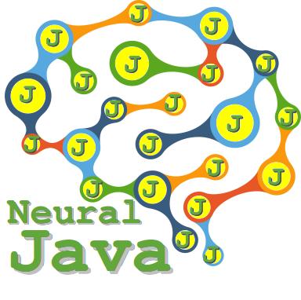
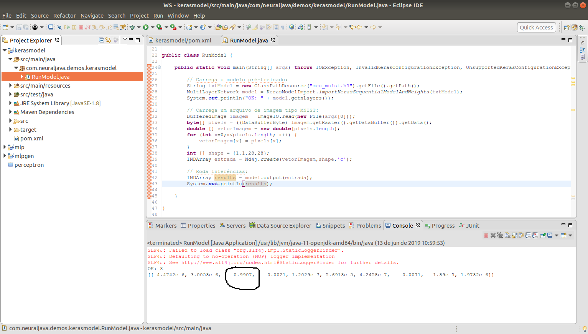

# Redes neurais e Deep Learning utilizando Java
[**Cleuton Sampaio**](https://github.com/cleuton) - [**LinkedIn**](https://www.linkedin.com/in/cleutonsampaio/) 


## Desenvolvimento em Python com produção em Java


Vamos utilizar o dataset [**MNIST**](http://yann.lecun.com/exdb/mnist/) para reconhecer dígitos escritos manualmente. Na verdade, vamos usar o próprio modelo de exemplo da [biblioteca **Keras**](https://github.com/keras-team/keras/blob/master/examples/mnist_cnn.py), de modo a não "reinventar a roda".

## Treinamento do modelo

O modelo será desenvolvido e treinado em **Python** utilizando a *API* **Keras** e a biblioteca **Tensorflow**. Até ai, nada demais. [**Confira o notebook**](./python_keras.ipynb).

O modelo é bem simples, sendo uma **CNN** com: 
- Duas camadas convolucionais;
- Uma camada de *Pooling* utilizando **max()**;
- Dropout de 25%;
- Camada *flatten* para reduzir a dimensão da matriz;
- Camada densa, com ativação **ReLU**;
- Outro Dropout de 50%;
- Camada final densa, com ativação **sigmóide**.

Todo o trabalho de treinamento do modelo foi feito no notebook **Jupyter** e o modelo final foi salvo (arquitetura e pesos):

```
model.save("meu_mnist.h5")
```

O formato [**HDF5**](https://www.tinymind.com/learn/terms/hdf5) preserva a arquitetura e os pesos encontrados. 

Agora é só ir para a parte **Java**.

## Rodando o modelo em "produção"

Como eu disse no início deste capítulo, vamos rodar nossa "produção" em uma aplicação **Java**. Para isto, vamos utilizar o modelo que foi salvo pelo nosso código **Python**. O modelo já inclui a **arquitetura** da rede neural convolucional e os **pesos** encontrados no treinamento, que foi feito pelo notebook com **Python**.

O arquivo de pesos [**meu_mnist.h5**](./meu_mnist.h5) já contém isso tudo, portanto, podemos utilizá-lo dentro do nosso código **Java**. 

**Como?**

Essa é uma boa pergunta! Poderíamos utilizar o [**DeepLearning4j**](https://deeplearning4j.org/), que é capaz de importar modelos salvos pelo **Keras**, em formato [**HDF5**](https://www.tinymind.com/learn/terms/hdf5).

Vamos criar uma app **Java** com **maven** e importar o arquivo de modelo salvo. Na verdade, vamos embutir o modelo dentro dos **resources** do projeto.

O projeto **maven** está na pasta [**java**](./java) com vários arquivos: 
- [**src**](./java/src): Pasta onde está o código-fonte e eu já coloquei o arquivo de modelo dentro de src/main/resources;
- [**pom.xml**](./java/pom.xml): Arquivo do projeto maven;
- [**dois.png**](./java/dois.png): Arquivo de imagem para inferir em produção;
- [**resultado.png**](./java/resultado.png): Imagem do programa já executado com a inferência correta.

**pom.xml**

O arquivo **pom.xml** inclui as dependências de duas bibliotecas: [**DeepLearning4j**](https://deeplearning4j.org/) e [**ND4J**](https://deeplearning4j.org/docs/latest/nd4j-overview), que é um **numpy** para **Java**.

```
<project xmlns="http://maven.apache.org/POM/4.0.0" xmlns:xsi="http://www.w3.org/2001/XMLSchema-instance"
  xsi:schemaLocation="http://maven.apache.org/POM/4.0.0 http://maven.apache.org/xsd/maven-4.0.0.xsd">
  <modelVersion>4.0.0</modelVersion>

  <groupId>com.neuraljava.demos</groupId>
  <artifactId>kerasmodel</artifactId>
  <version>0.0.1-SNAPSHOT</version>
  <packaging>jar</packaging>

  <name>kerasmodel</name>
  <url>http://maven.apache.org</url>

  <properties>
    <project.build.sourceEncoding>UTF-8</project.build.sourceEncoding>
    <maven.compiler.source>1.8</maven.compiler.source>
    <maven.compiler.target>1.8</maven.compiler.target>
  </properties>

  <dependencies>
    <dependency>
      <groupId>junit</groupId>
      <artifactId>junit</artifactId>
      <version>4.12</version>
      <scope>test</scope>
    </dependency>
	  <dependency>      
	    <groupId>org.deeplearning4j</groupId>      
	    <artifactId>deeplearning4j-core</artifactId>
	    <version>1.0.0-beta4</version>    
	  </dependency>         
	  <dependency>      
	    <groupId>org.deeplearning4j</groupId>      
	    <artifactId>deeplearning4j-modelimport</artifactId>      
	    <version>1.0.0-beta4</version>    
	  </dependency>                       
	  <dependency>      
	    <groupId>org.nd4j</groupId>      
	    <artifactId>nd4j-native-platform</artifactId>
	    <version>1.0.0-beta4</version>    
	  </dependency>
  </dependencies>
</project>

```

**Classe principal**

A classe principal, aliás a única que eu criei, vai fazer o seguinte:

1. Recuperar o modelo criado pelo Keras/Python, a partir dos **resources**;
2. Ler um arquivo de teste (dois.png) com uma imagem do algarismo dois, desenhado à mão;
3. Formatar a imagem em uma matriz apropriada para dar entrada no modelo do Keras;
4. Executar a inferência e exibir o resultado.

```
public class RunModel {

	public static void main(String[] args) throws IOException, InvalidKerasConfigurationException, UnsupportedKerasConfigurationException {
		
		// Carrega o modelo pré-treinado: 
		String txtModel = new ClassPathResource("meu_mnist.h5").getFile().getPath();
		MultiLayerNetwork model = KerasModelImport.importKerasSequentialModelAndWeights(txtModel);
		System.out.println("OK: " + model.getnLayers());
		
		// Carrega um arquivo de imagem tipo MNIST:
		BufferedImage imagem = ImageIO.read(new File(args[0]));
		byte[] pixels = ((DataBufferByte) imagem.getRaster().getDataBuffer()).getData();
		double [] vetorImagem = new double[pixels.length];
		for (int x=0;x<pixels.length; x++) {
			vetorImagem[x] = pixels[x];
		}
		int [] shape = {1,1,28,28};
		INDArray entrada = Nd4j.create(vetorImagem,shape,'c'); 
		
		// Roda inferências:
		INDArray results = model.output(entrada);
		System.out.println(results);
		
	}

}
```

A classe **KerasModelImport** é fantástica e nos permite importar um método *sequential* (o que criamos no nosso Keras/Python), com arquitetura e pesos.

Depois, usamos a classe **BufferedImage** para ler o arquivo PNG que eu gerei, com o algarismo dois desenhado à mão (28 x 28 pixels, tons de cinza):


Precisamos transformar um **byte[]** em **double[]** para podermos usar o objeto **INDArray**, que nos permite fazer o *reshape* da classe. Nosso modelo Keras espera um dataset de entrada com estas dimensões:

- registros, canais de cor, altura da imagem, largura da imagem

Nossa entrada é um vetor com 784 posições (flat), então precisamos criar uma matriz quadridimensional como descrito acima. 

Então, basta criar um INDArray com o formato que desejamos e alimentá-lo no modelo. Pronto!

O resultado da inferência pode ser visto na figura: 



É um vetor *one-hot-encoded* com 10 posições, respectivamente a probabilidade da figura ser um dos 10 dígitos (de zero a nove). Note que a maior probabilidade é que ele seja o algarismo dois (99,07%), portanto, o nosso modelo inferiu corretamente. Note que esta imagem **não faz parte do conjunto original do MNIST**, sendo gerada por mim com o **gimp**. 

Note também que houve probabilidades menores (porém significantes) do dígito ser um 3 ou um 7 (), mas sem dúvida é um algarismo dois. 

Para executar o programa, passe o caminho do arquivo de imagem como argumento para o Java. 

## Conclusão

É perfeitamente possível utilizar **Java** para desenvolver e treinar redes, mas, tenho que reconhecer, em **Python** é muito mais fácil. Mas podemos usar **Java** para importar o modelo e treinar com maior volume de dados, já que tem uma performance melhor que **Python**, ou então usar em produção.
